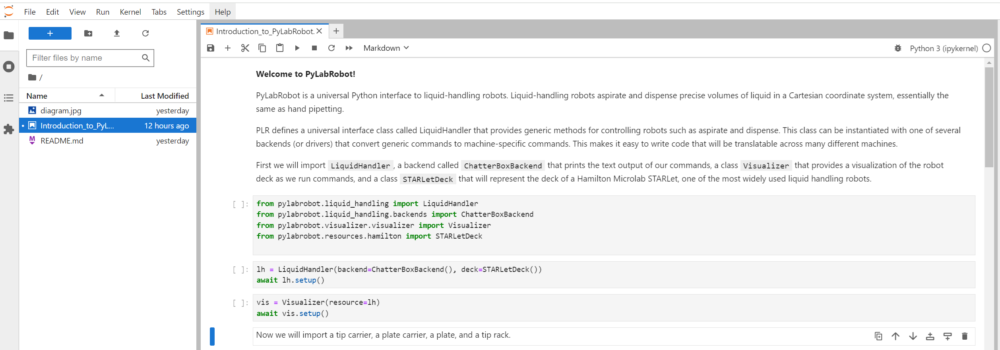

# PyLabRobot Tutorials BME590

## Installation

[Install Python=>3.8](https://www.python.org/downloads/release/python-3110/ 
[Install Git](https://git-scm.com/downloads) 

From the terminal: 
`pip install pylabrobot[extras_visualizer]` 
`pip install websockets` 
`pip install jupyterlab` 
`git clone https://github.com/stefangolas/PyLabRobot_Tutorials_BME590.git` 
`cd PyLabRobot_Tutorials_BME590` 
`jupyter lab` 

### Installation notes

It's possible you already have a version of some of the above dependencies. If you are worried about conflicts with existing packages, you can use a virtual environment. [How to Use Python Virtual Environments](https://realpython.com/python-virtual-environments-a-primer/).

You can use standard Jupyter Notebooks, but Jupyter Lab has a file system feature that is very convenient.

## Notebook
 The last command should have opened the Jupyter Lab notebook shown below. This is an example script that gives an overview of PyLabRobot's capabilities.
 There are other scripts that delve into specific topics such as `DataSimulations` that you can access from the same directory. Feel free to change the scripts
 to get a sense of what PyLabRobot can do.

 
